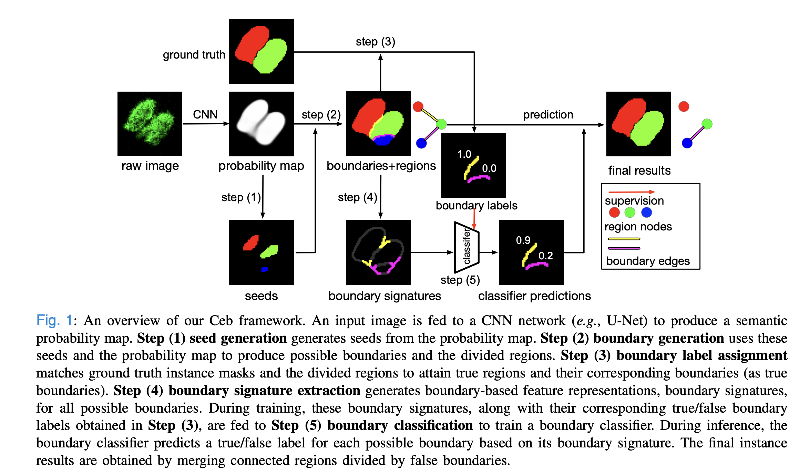

# Ceb

## Ceb Overview




## Installation

```
conda create -n Ceb python=3.10
conda activate Ceb

conda install pytorch==2.3.1 torchvision==0.18.1 torchaudio==2.3.1 pytorch-cuda=11.8 -c pytorch -c nvidia

conda install -c conda-forge scikit-image pillow numpy scikit-learn cvxpy imagecodecs

conda install -c conda-forge protobuf abseil-cpp opencv

pip install cvxopt matplotlib

pip install anytree
```
